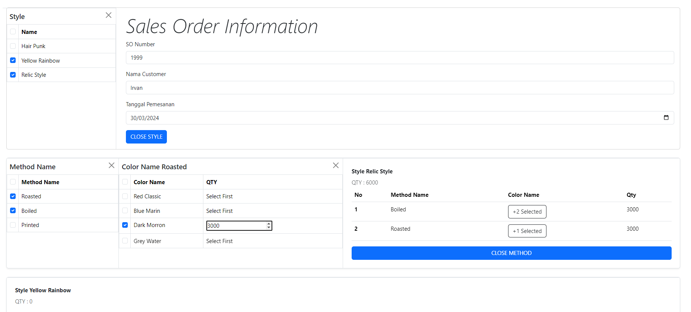

<a name="readme-top"></a>

<div align="center">

  <h3 align="center">Technical Test Yubi Technology</h3>

  <p align="center">
   </p>
</div>


<!-- ABOUT THE PROJECT -->
## About The Project



This is assignment for test placement in PT.Yubi Technology.

<p align="right">(<a href="#readme-top">back to top</a>)</p>


### Built With

* Vuex
* Vue 3
* Laravel 11
* MySql

<p align="right">(<a href="#readme-top">back to top</a>)</p>

<!-- GETTING STARTED -->
## Getting Started

### Prerequisites


* composer
* npm
* mySql

### Installation / Usage

   
1. Clone the repo
   ```sh
   git clone https://github.com/irvanmuhandis/testYubiTech.git
   ```
3. Open terminal in project directory   
2. Install NPM packages
   ```sh
   npm install
   ```
3. Start database MySql
4. Migrate database
   ```sh
   php artisan migrate
   ```
5. Seeding database
   ```sh
   php artisan db:seed
   ```
6. Start laravel server
   ```sh
   php artisan serve
   ```
7. Start Vue server
   ```sh
   npm run dev
   ```
8. Open browser  http://127.0.0.1:8000.


Distributed under the MIT License. See `LICENSE.txt` for more information.

<p align="right">(<a href="#readme-top">back to top</a>)</p>
